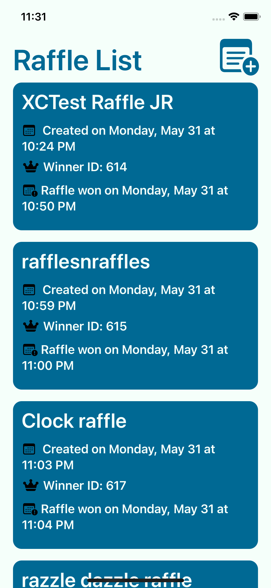
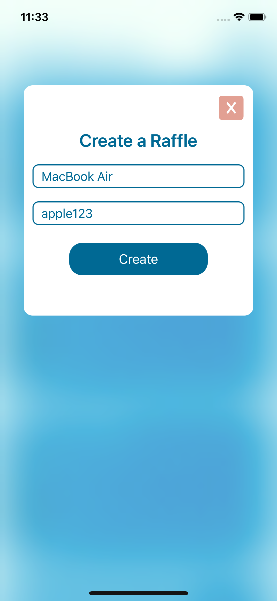
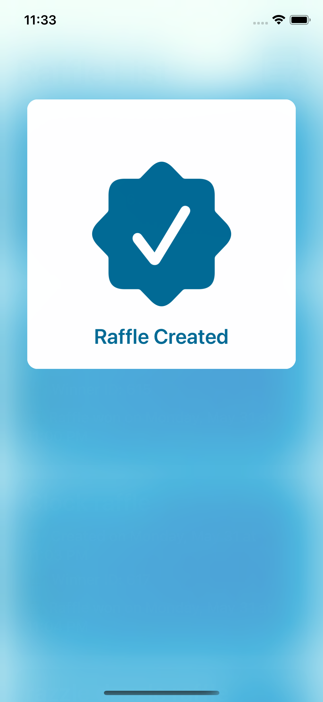
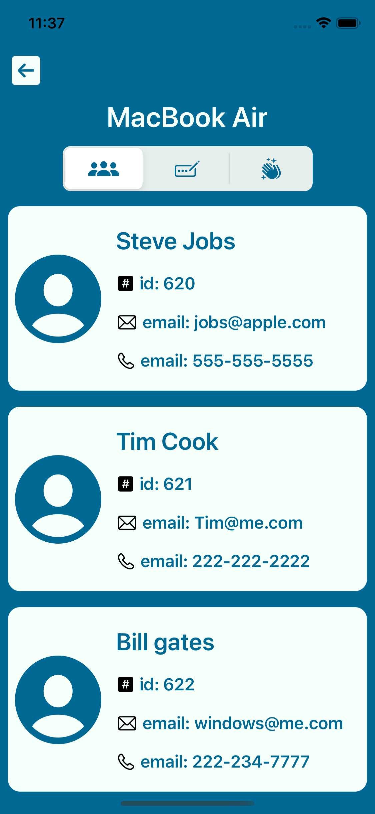
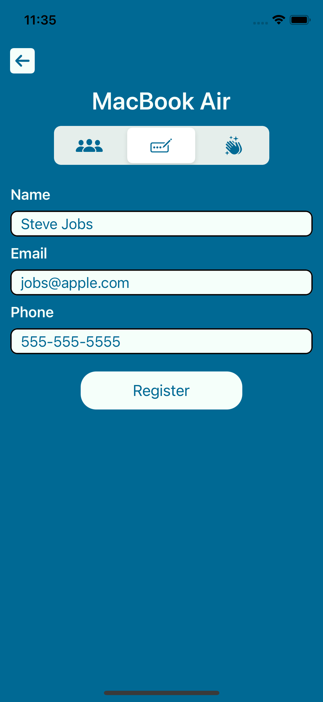
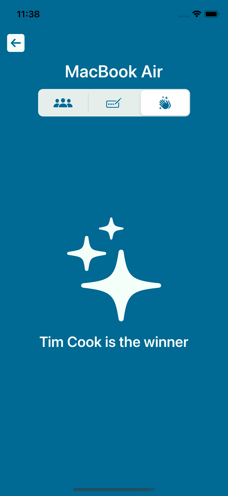

# PursuitUSVRaffleApp

An application that allows a user to view a collection of raffles. They can also create a new raffle, register for an existing raffle, as well as pick a raffle's winner. This app was built with UIKit, uses compositional layout, includes native animations, and follows the MVC design pattern.

# Future Implementations
- Incorporate Instruments for code coverage.
- Bookmarking of raffles you are registered for.
- Micro animations

# Screenshots

Home Screen | Create a raffle | Created Raffle |
---------|----------|----------------|
| | |

Participants | Register | Winner Picked |
---------|----------|----------------|
| | |
